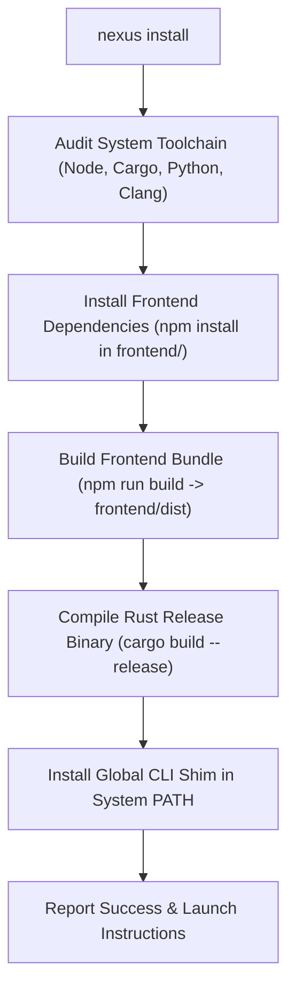

# NEXUS CLI — Installation & Setup Commands

This document details the environment bootstrap, dependency resolution, and workspace maintenance commands: `nexus install`, `nexus setup`, and `nexus clean`.

---

## 1. `nexus install`

### Description
Performs an automated end-to-end installation of all required dependencies, compiles the frontend Vite bundle, builds the release Rust executable, and establishes a global `nexus` command shim on the host operating system (`%USERPROFILE%\.cargo\bin\nexus.cmd` on Windows or `/usr/local/bin/nexus` on Unix).

### Syntax
```powershell
nexus install
# or from clean repo root:
node nexus.mjs install
```

### Needs & Prerequisites
- **Node.js**: v18.0.0 or higher
- **npm**: v9.0.0 or higher
- **Rust Toolchain**: `rustc` and `cargo` (1.75.0+)
- **LLVM / Clang**: Required on Windows for `bindgen` (sets `LIBCLANG_PATH`)
- **Python**: v3.10+ (for Whisper STT and NLU sidecars)
- **C++ Build Tools**: Visual Studio 2022 C++ x64/x86 build tools (Windows) or `build-essential` (Linux)

### Execution Flow


### Real-World Use Cases
1. **Fresh Machine Onboarding**: Run immediately after cloning `Engine-NEXUS/WINDOWS` to configure the workstation in one step.
2. **Global Command Registration**: Enables typing `nexus <command>` from any directory in PowerShell, CMD, or bash.

### Example Output
```text
[13:30:01] ==>   Installing frontend dependencies...
[13:30:05] OK    Frontend dependencies installed
[13:30:05] ==>   Building frontend assets...
[13:30:09] OK    Frontend built successfully
[13:30:09] ==>   Compiling Rust backend in release mode...
[13:31:12] OK    Rust binary built: src-tauri\target\release\nexus.exe
[13:31:12] ==>   Creating global CLI shim...
[13:31:13] OK    Global command 'nexus' installed to C:\Users\User\.cargo\bin\nexus.cmd
```

---

## 2. `nexus setup`

### Description
Performs the identical dependency installation and binary compilation as `nexus install`, but **omits** the creation of the global system-level CLI shim.

### Syntax
```powershell
node nexus.mjs setup
```

### Needs & Prerequisites
- Same toolchain requirements as `nexus install` (Node.js, Cargo, Python, Clang).

### Real-World Use Cases
1. **CI / CD Pipelines**: Used in GitHub Actions runners where global shims are unnecessary and isolated execution in the repository directory is preferred.
2. **Containerized Environments**: Docker builds and sandbox workspaces where path modifications should remain local.

---

## 3. `nexus clean`

### Description
Removes all compilation artifacts, cached intermediate files, and distribution bundles across both the Rust and frontend toolchains.

### Syntax
```powershell
nexus clean
# or
node nexus.mjs clean
```

### Cleared Directories
- `src-tauri/target/` (Rust incremental compilation and debug/release binaries)
- `frontend/dist/` (Vite production bundle)
- `frontend/node_modules/.vite/` (Vite cache)

### Real-World Use Cases
1. **Corrupted Build Recovery**: Use when encountering stale link errors or ABI mismatches following upstream dependency updates.
2. **Disk Reclamation**: Reclaims 2–10 GB of temporary Cargo target cache before archiving or creating release bundles.

### Example Output
```text
[13:35:00] ==>   Cleaning build artifacts...
[13:35:02] OK    Removed src-tauri/target
[13:35:03] OK    Removed frontend/dist
[13:35:03] OK    Workspace is clean
```
