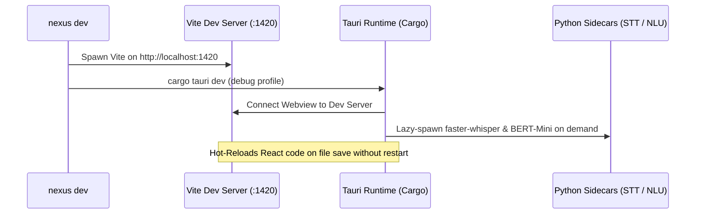

# NEXUS CLI — Development, Compilation & Launch Commands

This document details the daily development, hot-reloading, compilation, and runtime launch commands: `nexus dev`, `nexus build`, and `nexus start` / `nexus run`.

---

## 1. `nexus dev`

### Description
Launches the full NEXUS development environment with real-time Hot Module Replacement (HMR) for the React frontend via Vite, coupled with live Rust Tauri backend debugging and sidecar subprocess supervision.

### Syntax
```powershell
nexus dev
```

### Needs & Prerequisites
- Frontend dependencies installed (`frontend/node_modules`)
- Rust toolchain and LLVM/Clang available
- Python runtime for STT/NLU lazy sidecars

### Architecture & Runtime Flow


### Real-World Use Cases
1. **Frontend UI Development**: Modifying the HUD orb, floating response sidebar, or settings panels with instantaneous live preview.
2. **IPC & Bridge Iteration**: Developing Tauri command handlers, voice approval flows, and MCP bridge interactions with interactive debug logs.

---

## 2. `nexus build`

### Description
Compiles the production release bundle: generates an optimized, tree-shaken frontend distribution in `frontend/dist/` and compiles the standalone Rust binary with release optimizations (`opt-level = 3`, LTO, strip symbols).

### Syntax
```powershell
nexus build
```

### Outputs
- **Executable**: `src-tauri/target/release/nexus.exe` (Windows) or `nexus` (macOS/Linux)
- **Embedded Assets**: Bundled ONNX models (`melspectrogram.onnx`, `embedding_model.onnx`, `nexus.onnx`), icons, and static assets.

### Real-World Use Cases
1. **Local Release Verification**: Verifies that custom protocols (`nexus://`), asset resolution, and release optimizations execute without errors.
2. **Standalone Testing**: Produces a single self-contained executable suitable for installer packaging.

### Example Output
```text
[13:40:00] ==>   Building frontend (Vite)...
vite v5.4.2 building for production...
✓ 142 modules transformed.
dist/index.html                   0.82 kB
dist/assets/index-D9zK2L3.js    214.15 kB │ gzip: 68.22 kB
[13:40:04] OK    Frontend build complete
[13:40:04] ==>   Compiling Rust release binary (cargo build --release)...
    Finished release [optimized] target(s) in 1m 08s
[13:41:12] OK    Build successful: src-tauri\target\release\nexus.exe
```

---

## 3. `nexus start` / `nexus run`

### Description
Launches the previously compiled production release binary (`src-tauri/target/release/nexus.exe`). If no release binary exists, it automatically triggers `nexus build` first before launching.

### Syntax
```powershell
nexus start
# or
nexus run
```

### Real-World Use Cases
1. **Daily Assistant Operation**: Launching NEXUS as your everyday desktop AI assistant with zero debug overhead.
2. **Performance Benchmarking**: Measuring cold startup time, idle RAM footprint (~60MB), and voice response latency under production conditions.
