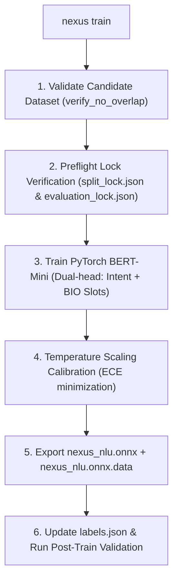

# NEXUS CLI — NLU Engine, Training & Voice Collection Commands

This document details the Natural Language Understanding (NLU) lifecycle commands: `nexus train`, `nexus audit`, `nexus collect`, and `nexus stats`.

---

## 1. `nexus train`

### Description
Executes the full automated training pipeline for the BERT-Mini NLU intent and slot classification engine. It stages candidate data, performs cryptographic overlap validation, trains the dual-head PyTorch transformer model, calibrates temperature scaling, and exports an optimized ONNX graph to `server/nlu/model/nexus_nlu.onnx`.

### Syntax
```powershell
nexus train
```

### Training Pipeline Stages


### Real-World Use Cases
1. **Model Evolution**: Retraining the assistant's brain after collecting new voice phrases or adding new GitHub/MCP intents.
2. **Zero-Quarantine Promotion**: Baking newly approved intent phrase families into production weights.

---

## 2. `nexus audit`

### Description
Runs a rigorous audit against the current NLU dataset and trained ONNX model to detect data poisoning, cross-split phrase-family leakage, slot label misalignments, and out-of-scope (OOS) false trigger rates.

### Syntax
```powershell
nexus audit
```

### Audited Metrics
- **Intent Accuracy**: Overall test set intent classification accuracy (Target: > 96.0%).
- **Slot F1 Score**: BIO entity extraction token F1 score (Target: > 92.0%).
- **Cross-Split Leakage**: Mathematical guarantee that zero phrase families span train and test splits.
- **OOS Discrimination**: Rejection of unrelated queries (CLINC150 out-of-scope evaluation).

### Example Output
```text
=================================================================
  NEXUS NLU DATASET & MODEL AUDIT REPORT
=================================================================
  • Total Training Rows   : 3,108 samples across 55 intents
  • Evaluation Set        : 481 test samples (Cryptographically locked)
  • Intent Accuracy       : 97.4% on held-out test split
  • Slot Entity F1        : 94.2% across 51 slot categories
  • Split Leakage         : 0.00% (Strict zero family crossover)
  • OOS Rejection Rate    : 98.8%
=================================================================
  STATUS: MODEL MEETS PRODUCTION DEPLOYMENT THRESHOLDS
=================================================================
```

---

## 3. `nexus collect`

### Description
Interactive and targeted voice sample collection interface. Records spoken audio from the developer, transcribes it via `faster-whisper` with domain vocabulary biasing, extracts entity slots, and appends the audited sample directly to `wake_word_data/collected_samples.jsonl`.

### Syntax
```powershell
# Interactive Category Drill-Down:
nexus collect

# Target a specific Category:
nexus collect --category github
nexus collect -c mcp

# Target a single Intent directly:
nexus collect --intent create_pr
nexus collect -i order_food

# Combined Scope Validation:
nexus collect -c github -i analyse_pr
```

### Flags & Options
| Flag | Short | Description | Example |
| :--- | :--- | :--- | :--- |
| `--category` | `-c` | Filter interactive menu to a specific category (`github`, `mcp`, `apps`, `messages`, `live`, `system`) | `nexus collect -c github` |
| `--intent` | `-i` | Directly target a single intent from the 55 BERT-Mini catalog | `nexus collect -i order_food` |
| `--count` | `-n` | Specify number of voice samples to record for the session | `nexus collect -i search_product -n 10` |

### Real-World Use Cases
1. **Targeting Weak Intents**: Quickly recording 10 spoken variations for a newly added feature or low-accuracy intent.
2. **Acoustic Diversity**: Adding real accent and microphone recordings directly into the training corpus.

---

## 4. `nexus stats` / `nexus coverage`

### Description
Inspects and visualizes dataset category coverage, voice collection volume, mastery ratings across all 55 intents, and recommends the next best intents to record.

### Syntax
```powershell
nexus stats
# Aliases:
nexus coverage
nexus status
```

### Mastery Status Thresholds
- **● Strong**: $\ge 50$ unique phrase variations with full slot coverage.
- **◐ Good**: $25 - 49$ variations.
- **▲ Needs Work**: $< 25$ variations (flagged with interactive collection prompt).

### Example Output
```text
=================================================================
  NEXUS NLU INTENT MASTERY & COVERAGE BREAKDOWN
=================================================================
  Category: GITHUB (23 Intents, 1,240 Samples)
    • create_pr               ● Strong  (78 samples)
    • analyse_pr              ● Strong  (64 samples)
    • list_prs                ● Strong  (82 samples)
    • comment_pr              ◐ Good    (34 samples)

  Category: MCP COMMERCE & SOCIAL (4 Intents, 288 Samples)
    • order_food              ● Strong  (77 samples)
    • send_whatsapp_message   ● Strong  (72 samples)
    • search_product          ◐ Good    (32 samples)
    • whatsapp_search         ● Strong  (107 samples)

  RECOMMENDATION: Run 'nexus collect -i search_product' to reach Strong mastery.
=================================================================
```
