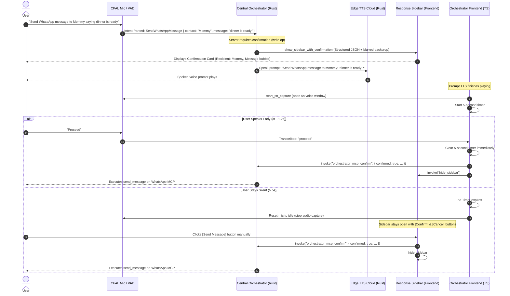

# 54 — Interactive Voice Approval & Confirmation Sidebar Architecture

## Overview

The **Interactive Voice Approval & Confirmation Sidebar** provides a dual-modality approval pipeline for operations that require user confirmation (such as sending WhatsApp messages, placing food/grocery orders on Swiggy, or performing destructive GitHub actions like PR merges or branch deletions).

### Key Highlights
1. **Visual Sidebar Presentation**: Whenever an action requires confirmation, the **Response Sidebar** automatically opens with structured details (recipient, message text, repository name, PR number, parameters, and danger warnings).
2. **Automatic 5-Second Voice Listening Window**: As soon as NEXUS finishes speaking the confirmation prompt, the microphone automatically opens in `listening` mode—no wake word or hotkey required.
3. **Instant Early Execution (< 2s)**: If the user speaks an approval word (*"proceed"*, *"approved"*, *"yes"*, *"confirm"*, *"go ahead"*) within the first 1–2 seconds, NEXUS immediately clears the 5-second timer and executes the approved action without delay.
4. **Graceful Timeout & Persistence**: If 5 seconds elapse with no speech, the microphone resets to `idle` to prevent stray background noise and save CPU, while the **Response Sidebar remains open on screen** for manual 1-click review and execution.

---

## Architecture & Data Flow



---

## 1. Voice Approval Window Mechanics

### Automatic Mic Activation
In [`frontend/src/net/orchestrator.ts`](file:///c:/PROJECTS/ULTRON/frontend/src/net/orchestrator.ts), the `case "confirm"` event handler registers an `onEnd` callback on the prompt TTS playback:
```typescript
if (ev.prompt) {
  store.addAssistantMessage(ev.prompt);
  void speak(ev.prompt, () => {
    // As soon as prompt TTS completes, open the mic for a 5-second listening window
    const curStore = useAssistant.getState();
    if (curStore.pendingGithubCommand) {
      curStore.setState("listening");
      import("@tauri-apps/api/core")
        .then(({ invoke }) => invoke("start_stt_capture"))
        .catch(() => {});

      clearConfirmListeningTimer();
      confirmListeningTimer = setTimeout(() => {
        confirmListeningTimer = null;
        const latest = useAssistant.getState();
        if (latest.state === "listening" && latest.pendingGithubCommand) {
          latest.reset(); // Orb resets to idle; sidebar remains open
        }
      }, 5000);
    }
  });
}
```

### Instant Execution on Speech (< 2s)
When speech is transcribed in `processViaOrchestrator`, the 5-second timer is immediately cancelled via `clearConfirmListeningTimer()`:
```typescript
const store = useAssistant.getState();
const pendingCmd = store.pendingGithubCommand;
if (pendingCmd) {
  clearConfirmListeningTimer();
  const lower = transcript.trim().toLowerCase();
  const isYes = /^(yes|yeah|yep|yup|confirm|ok|okay|sure|go ahead|do it|proceed|approved?|agreed?|approve)\b/i.test(lower);
  const isNo = /^(no|nope|cancel|abort|stop|don't|dont|never|disapproved?|disapprove)\b/i.test(lower);

  if (isYes) {
    store.setPendingGithubCommand(null);
    useAssistant.getState().addUserMessage(transcript);
    // Dispatches confirmed call & hides sidebar immediately
  }
}
```

---

## 2. Expanded Approval Vocabulary

| Action Intent | Accepted Natural Phrases |
|---|---|
| **Confirm & Proceed** | `approved`, `approve`, `proceed`, `yes`, `yeah`, `yep`, `yup`, `confirm`, `ok`, `okay`, `sure`, `go ahead`, `do it`, `agreed`, `agree` |
| **Cancel & Abort** | `cancel`, `abort`, `no`, `nope`, `stop`, `don't`, `dont`, `never`, `disapproved`, `disapprove` |

---

## 3. Sidebar Confirmation Card Component

The confirmation card is implemented in [`frontend/src/sidebar/ConfirmationPanel.tsx`](file:///c:/PROJECTS/ULTRON/frontend/src/sidebar/ConfirmationPanel.tsx) and embedded in [`frontend/src/sidebar/SidebarApp.tsx`](file:///c:/PROJECTS/ULTRON/frontend/src/sidebar/SidebarApp.tsx).

### Features
1. **Dynamic Service Badges**:
   - **WhatsApp**: Emerald `#25d366` badge, recipient display, and green-bordered message preview block.
   - **GitHub**: Purple `#8957e5` badge, repository name, PR number, and branch.
   - **Swiggy / Amazon**: Brand badges with tool and parameter breakdown.
2. **Interactive Controls**:
   - **`[✓ Confirm]` / `[✓ Send Message]` / `[✓ Confirm Merge]`**: Dispatches IPC call to Rust and hides sidebar.
   - **`[✕ Cancel]`**: Sends abort signal and dismisses sidebar.
   - **Loading State**: Displays animated spinner while dispatching.
3. **Voice Hint**:
   - Displays *"💡 Say 'Yes' or 'Cancel', or click an option above"* to guide the user.

---

## 4. Rust Central Orchestrator Integration

### IPC Command (`src-tauri/src/commands.rs`)
```rust
#[tauri::command]
pub async fn show_sidebar_with_confirmation<R: Runtime>(
    app: tauri::AppHandle<R>,
    query: String,
    prompt: String,
    confirmation: serde_json::Value,
) -> Result<(), String>
```
- Captures blurred desktop backdrop via Windows DWM BitBlt.
- Stores pending confirmation in static mutex `PENDING_SIDEBAR` for race-free initial window creation.
- Emits `sidebar:confirmation` event for already-mounted sidebar windows.

---

## 5. Verification Matrix

| Test Suite | Location | Result | Coverage |
|---|---|---|---|
| **Rust Unit Tests** | `src-tauri` | **519 / 519 Passed** | Deterministic intent parser, MCP gates, GitHub dispatch |
| **Rust Compiler** | `src-tauri` | **0 Errors / 0 Warnings** | `cargo check` clean |
| **Frontend Vitest** | `frontend` | **17 / 17 Passed** | Confirmation approvals (`proceed`, `approved`, `cancel`), loading machine, avatar |
| **Frontend TypeScript** | `frontend` | **0 Errors** | `tsc --noEmit` clean |
| **Frontend Production Build** | `frontend` | **0 Errors** | Production bundle emitted successfully |
| **Cloudflare Worker Tests** | `server/worker` | **49 / 49 Passed** | PR analysis, GitHub tools, session token security |
| **Total Workspace** | Workspace | **585 / 585 Passed** | 100% test pass rate across all layers |
