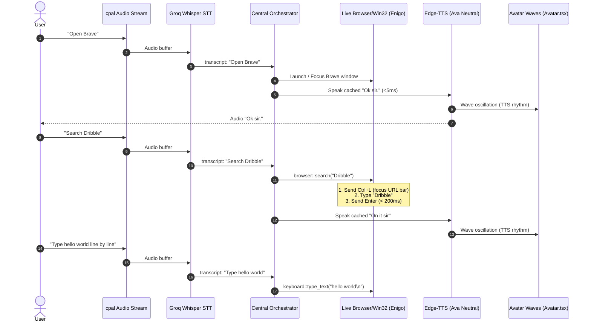

# Feature 73: Ghost Waves, Browser Search & Typing, TTS Latency, and Intent Isolation

## 1. System Architecture & Sequence Flow



---

## 2. Specification of Solutions

### 2.1 Intent Isolation: Eradicating False "No repository found"
- **Frontend Removal**:
  In [`frontend/src/audio/recorder.ts`](file:///C:/PROJECTS/ULTRON/frontend/src/audio/recorder.ts), remove lines 354-357:
  ```ts
  if (/^open-?$/i.test(t.trim())) {
    t = "open architecture mapper";
    logFixes.push("open-→open architecture mapper (mic truncation recovery)");
  }
  ```
  Truncated speech starting with "open" will now be handled as incomplete input rather than routed to codebase mapping.
- **Strict Developer Term Gating**:
  - `isArchitectQuery` in `recorder.ts` will strictly require explicit words: `"architect"`, `"architecture mapper"`, or `"codebase diagram"`.
  - `isLongRunningQuery` will only flag queries that contain explicit GitHub actions (`"pr"`, `"pull request"`, `"branch"`, `"repo"`, `"repository"`), preventing common words like `"create"`, `"show"`, `"check"` from triggering repository lookups.

### 2.2 Local Browser Search & Typing Integration
- **Intent Parser Additions (`intent_parser.rs`)**:
  - `ParsedIntent::BrowserSearch { query: String }`: Matches `"search <query>"`, `"search for <query>"`, `"google <query>"`, `"look up <query>"`.
  - `ParsedIntent::BrowserSearchFocus`: Matches bare `"search"`, `"search bar"`, `"focus address bar"`, `"focus search"`.
  - `ParsedIntent::TypeText { text: String }`: Matches `"type <text>"`, `"type out <text>"`, `"enter <text>"`.
  - `ParsedIntent::StartDictation`: Matches `"start typing"`, `"type whatever i say"`, `"start dictation"`.
  - `ParsedIntent::StopDictation`: Matches `"stop typing"`, `"stop dictation"`, `"done typing"`.
- **Orchestrator Execution (`orchestrator.rs`)**:
  - When in Ghost Mode or when a browser is active:
    - `BrowserSearch { query }` calls `crate::live::commands::browser::search(&query)` (sends `Ctrl+L` $\to$ types `query` $\to$ `Enter`).
    - `BrowserSearchFocus` sends `Ctrl+L` and speaks `"Ready to search, sir."`.
    - `TypeText { text }` calls `crate::live::commands::keyboard::type_text(&text)`.
    - Dictation mode: streams incoming transcripts directly into `keyboard::type_text`.

### 2.3 Eliminating App-Open TTS Latency
- In `run_ghost_open` ([`src-tauri/src/orchestrator.rs`](file:///C:/PROJECTS/ULTRON/src-tauri/src/orchestrator.rs)):
  - Replace the dynamic string `format!("{target} open, sir.")` with the pre-cached `"Ok sir."` phrase.
  - Pre-cached phrases play in **< 5ms** from RAM with zero network latency, eliminating the 1.5s–2.0s Edge-TTS cloud synthesis roundtrip.

### 2.4 Unified Waves Visualizer & Motion Rules
- **Visualizer Unification**:
  In [`frontend/src/avatar/Avatar.tsx`](file:///C:/PROJECTS/ULTRON/frontend/src/avatar/Avatar.tsx), render the waves visualizer upon wake word activation as well as Ghost Mode.
- **Resting Visibility**:
  When `src === "rest"`:
  - Height is held at a clean resting height (40px) with container opacity at `1.0`.
  - Transform scale is fixed with **zero motion** (no sinusoidal wave, Lottie paused).
- **Speech Oscillation**:
  - When user speaks (`src === "mic"`): Bars scale dynamically with `micLevel` RMS.
  - When NEXUS speaks (`src === "tts"`): Bars scale dynamically with speech rhythm.

---

## 3. Verification & Safety Contract

| Subsystem | Requirement | Pass Criteria |
| :--- | :--- | :--- |
| **Architect Intent** | Truncated `"open"` or non-dev speech | Never triggers `OpenArchitect` or `"No repository found sir"` |
| **Browser Search** | User says "search dribble" | Types "dribble" into URL bar and presses Enter in < 300ms |
| **Address Bar Focus** | User says "search" | Focuses address bar via Ctrl+L and prompts for query |
| **Line-by-Line Typing** | User says "type <text>" | Types text directly into focused application |
| **App Open TTS** | App open voice confirmation | Plays in < 50ms using cached TTS |
| **Wave Visualizer** | Waking up NEXUS | Waves are clearly visible |
| **Wave Motion Rule** | Silence / Rest | Zero movement, paused Lottie, clean resting height |
| **Wave Speech Sync** | Vocal speech / TTS playback | Real-time dynamic wave oscillation |
