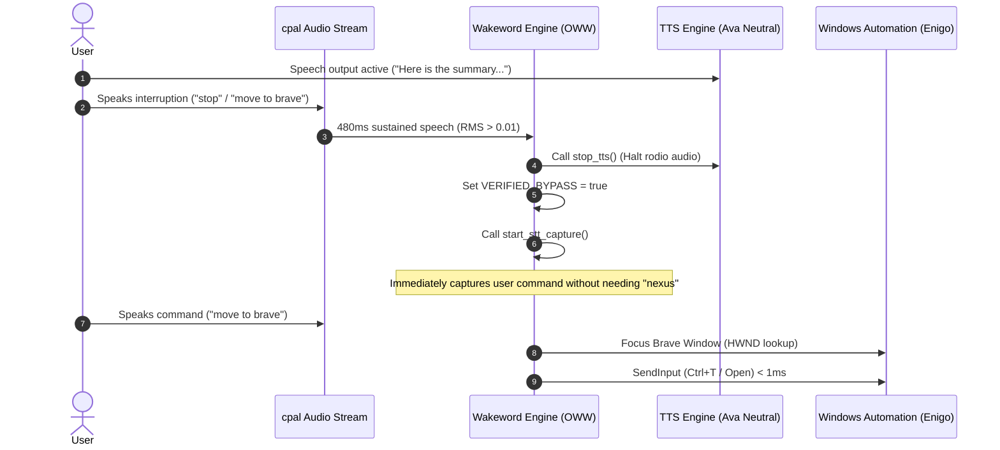

# 73 — System Voice Lock, Ghost Orb Waves & Win32 Barge-In Architecture

## 1. System Sequence Diagram

## 2. Component Reference & Configuration Invariants

### 2.1 TTS Engine Constraints
- **Voice Model**: `en-US-AvaNeural`
- **Prosody Mode**: `Neutral` (`+0%` speed, `+0%` volume, `+0Hz` pitch)
- **Primary Transport**: Microsoft Speech WebSocket (Edge-TTS cloud)
- **Local Fallback**: `piper-amy` (ONNX mono)

### 2.2 Ghost Mode Orb Geometry & Wave Visuals
- **Animation Asset**: `frontend/public/waves.json`
- **Idle Wave Motion**: Sinusoidal floor `scaleY(0.26 + 0.08 * sin(t))`
- **Window Visibility State**: Pinned (`visible = true`) while `ghostActive == true`

### 2.3 Win32 Input & Browser Control
- **Focus Guard**: `AttachThreadInput` + `SetForegroundWindow` on target browser HWND
- **Supported Browsers**: Brave, Chrome, Edge, Firefox, Opera
- **Hotkey Engine**: `enigo::Enigo` direct Win32 `SendInput` API (< 1ms execution)

---

## 3. Documentation Index

- **Research Deep Dive**: [`docs/research/voice-and-browser-control-deep-dive-2026-09-28.md`](../research/voice-and-browser-control-deep-dive-2026-09-28.md)
- **Implementation Changes**: [`docs/changes/54-deep-dive-research-root-causes-and-implementation-architecture.md`](../changes/54-deep-dive-research-root-causes-and-implementation-architecture.md)
- **Master Changelog**: [`docs/changes/CHANGELOG.md`](../changes/CHANGELOG.md)
- **Agent Instructions**: [`AGENTS.md`](../../AGENTS.md)
