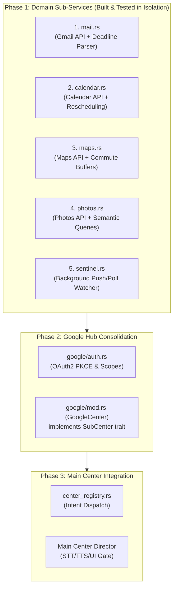

# Feature 75: GoogleCenter Hierarchical Domain Architecture & Proactive Sentinel — Implementation Plan

## 0. Executive Vision & Architectural Contract

NEXUS requires both **reactive execution** (answering voice commands across the Google ecosystem) and **proactive intelligence** (monitoring deadlines, travel delays, and schedule conflicts in the background without being prompted).

Following the **Feature 74 Main Center + Sub-Center Architecture**, Google is structured as a **Hierarchical Domain Hub**:
1. **Domain Sub-Services**: Isolated, single-responsibility modules (`mail`, `calendar`, `maps`, `photos`, `sentinel`) each built, mocked, and unit-tested to 100% green before integration.
2. **`GoogleCenter`**: Implements the `SubCenter` trait (`validate`, `execute`, `confirm_kind`), routes intents to the correct domain sub-service, and manages shared OAuth2 PKCE sessions.
3. **Main Center Connection**: Connects to `center_registry.rs`, adhering to single-point-of-truth UI/TTS directives.
4. **Proactive Sentinel**: Background daemon that wakes the assistant when critical external events occur (e.g. deadline change from an email).

---

## 1. Directory & Code Topology

```
src-tauri/src/
├── center.rs                       # Feature 74: SubCenter trait, Validity, UiDirective
├── center_registry.rs              # Feature 74: Main router matching intent -> SubCenter
│
└── google/                         # Feature 75: Google Hub
    ├── mod.rs                      # GoogleCenter (implements SubCenter trait)
    ├── auth.rs                     # Google OAuth2 PKCE, auto-refresh, scope store
    ├── client.rs                   # Resilient HTTP client with retry, backoff & quota
    ├── types.rs                    # Strongly-typed domain models (Mail, Event, Route, Photo)
    ├── sentinel.rs                 # Proactive background watcher (deadlines, delays)
    │
    ├── mail.rs                     # Sub-Service 1: Gmail (triage, drafts, deadline extraction)
    ├── calendar.rs                 # Sub-Service 2: Calendar (agenda, buffers, rescheduling)
    ├── maps.rs                     # Sub-Service 3: Maps (commute, route optimization, traffic)
    └── photos.rs                   # Sub-Service 4: Photos (semantic visual search, albums)
```

---

## 2. Phased Implementation Roadmap



---

### Phase 1: Domain Sub-Services (Unit-Tested in Isolation)

Each module is implemented with pure models, HTTP mocking fixtures, and zero coupling to Tauri UI or other centers.

#### Sub-Service 1: `mail.rs` (Gmail)
* **Responsibilities**:
  - `search_threads(query: &str) -> Vec<MailThread>`
  - `get_thread_details(id: &str) -> MailThreadDetails`
  - `draft_reply(thread_id: &str, body: &str) -> DraftReceipt`
  - `send_email(to: &str, subject: &str, body: &str) -> SendReceipt`
  - `extract_deadline_update(body: &str) -> Option<DeadlineUpdate>` (parses "deadline moved to 5 PM", "submission extended", etc.)
* **Dialog Slots**:
  - Required for Send: `recipient`, `body`. Elicitation prompt: *"Who would you like me to send this email to, sir?"*
* **Test Gate**: Mock responses for thread list, draft creation, and regex/NLP deadline extraction (10+ tests).

#### Sub-Service 2: `calendar.rs` (Google Calendar)
* **Responsibilities**:
  - `get_daily_agenda(date: NaiveDate) -> Vec<CalendarEvent>`
  - `create_event(title: &str, start: DateTime, end: DateTime) -> EventReceipt`
  - `reschedule_event(event_id: &str, new_start: DateTime) -> EventReceipt`
  - `find_free_buffer(duration_minutes: u32, preferred_range: TimeRange) -> Option<TimeRange>`
* **Dialog Slots**:
  - Required: `title`, `start_time`. Elicitation prompt: *"What time should I schedule {title}, sir?"*
* **Test Gate**: Conflict detection, timezone handling, ISO 8601 parsing (8+ tests).

#### Sub-Service 3: `maps.rs` (Google Maps)
* **Responsibilities**:
  - `get_route_summary(origin: &str, destination: &str, mode: TravelMode) -> RouteSummary`
  - `check_commute_delay(destination: &str, target_arrival: DateTime) -> CommuteAlert`
  - `find_places(query: &str, open_now: bool) -> Vec<PlaceItem>`
* **Dialog Slots**:
  - Required: `destination`. Elicitation prompt: *"Where would you like directions to, sir?"*
* **Test Gate**: Polyline decoding, traffic duration parsing, multi-stop sequencing (8+ tests).

#### Sub-Service 4: `photos.rs` (Google Photos)
* **Responsibilities**:
  - `search_photos(semantic_query: &str, date_range: Option<DateRange>) -> Vec<PhotoItem>`
  - `get_album(title: &str) -> Option<AlbumDetails>`
* **Dialog Slots**:
  - Required: `query`. Elicitation prompt: *"What photos or memories would you like me to find, sir?"*
* **Test Gate**: Semantic filter mapping, pagination, media URL hydration (6+ tests).

#### Sub-Service 5: `sentinel.rs` (Proactive Background Sentinel)
* **Responsibilities**:
  - Polls or listens for Gmail history updates (`historyId`) and Calendar push changes.
  - Matches incoming messages against the user's **Sentinel Rules**:
    - Sender whitelist (e.g. `professor@university.edu`, `boss@company.com`).
    - Critical topics (`deadline`, `time change`, `canceled`, `emergency`).
  - Emits proactive internal notifications: `ProactiveAlert { source, summary, urgency, suggested_action }`.
* **Test Gate**: De-duplication ring buffer (no double-alerting), thread-sleep cadence, meeting mute suppression (6+ tests).

---

### Phase 2: Google Hub Consolidation (`google/mod.rs`)

`GoogleCenter` wraps all 5 sub-services into a unified entity conforming to `trait SubCenter`.

```rust
pub struct GoogleCenter {
    auth: Arc<GoogleAuth>,
    client: Arc<GoogleClient>,
    mail: MailService,
    calendar: CalendarService,
    maps: MapsService,
    photos: PhotosService,
    sentinel: Arc<Sentinel>,
}

impl SubCenter for GoogleCenter {
    fn name(&self) -> &'static str { "GoogleCenter" }

    fn validate(&self, intent: &ParsedIntent) -> Validity {
        match intent {
            ParsedIntent::GoogleMailSend { to, body } => {
                if to.trim().is_empty() {
                    return Validity::NeedSlot {
                        slot: "recipient",
                        prompt: "Who should I address the email to, sir?".to_string(),
                    };
                }
                if body.trim().is_empty() {
                    return Validity::NeedSlot {
                        slot: "body",
                        prompt: format!("What would you like to say to {}, sir?", to),
                    };
                }
                Validity::Ok
            }
            ParsedIntent::GoogleMapsRoute { destination, .. } => {
                if destination.trim().is_empty() {
                    return Validity::NeedSlot {
                        slot: "destination",
                        prompt: "Where are you heading, sir?".to_string(),
                    };
                }
                Validity::Ok
            }
            // Exhaustive mapping across all Google intents...
            _ => Validity::Ok,
        }
    }

    async fn execute(&self, app: &AppHandle, intent: &ParsedIntent) -> Receipt {
        match intent {
            ParsedIntent::GoogleMailSend { to, body } => {
                self.mail.send_email(to, "Update from NEXUS", body).await
            }
            ParsedIntent::GoogleMapsRoute { destination, mode } => {
                self.maps.get_route_summary("current_location", destination, *mode).await
            }
            // Domain dispatch...
        }
    }

    fn confirm_kind(&self, intent: &ParsedIntent) -> ConfirmKind {
        match intent {
            // Destructive actions gate with explicit user confirmation
            ParsedIntent::GoogleMailSend { .. } => ConfirmKind::Gate {
                prompt: "Are you ready for me to send this email, sir?".to_string(),
                timeout_s: 30,
            },
            _ => ConfirmKind::None,
        }
    }
}
```

---

### Phase 3: Main Center Integration (`center_registry.rs`)

1. **Routing Registration**:
   `center_registry.rs` adds arms routing `ParsedIntent::Google*` strictly to `GoogleCenter`.
2. **Proactive Alert Bridge**:
   When `sentinel.rs` detects an urgent event:
   ```rust
   // Sentinel invokes the Main Center's single UI/TTS director
   main_center::dispatch_proactive_alert(app, ProactiveAlert {
       title: "Deadline Update",
       spoken_line: "Sir, Professor Miller updated the project deadline to tomorrow at 5 PM.",
       directive: UiDirective::Speak { ... },
   });
   ```
3. **Collision Protection**:
   The Main Center verifies `!stt_active && !meeting_active && !user_speaking` before speaking proactive lines, ensuring NEXUS never interrupts your phone calls or active speech.

---

## 3. Dual-Gate Verification Metrics

| Gate | Acceptance Criteria |
| :--- | :--- |
| **Domain Tests** | 100% green tests across `mail_test.rs`, `cal_test.rs`, `maps_test.rs`, `photos_test.rs`, `sentinel_test.rs` using mock fixtures. |
| **Slot Validation Gate** | Missing slots elicit exact spoken phrases without crashing or invoking cloud LLM chat. |
| **Proactive Alert Gate** | Simulated deadline email triggers a single proactive speech alert + calendar reminder sync with 0 UI glitches. |
| **Binary Verification** | Release build compiles cleanly with zero warnings (`node nexus.mjs build`). |
