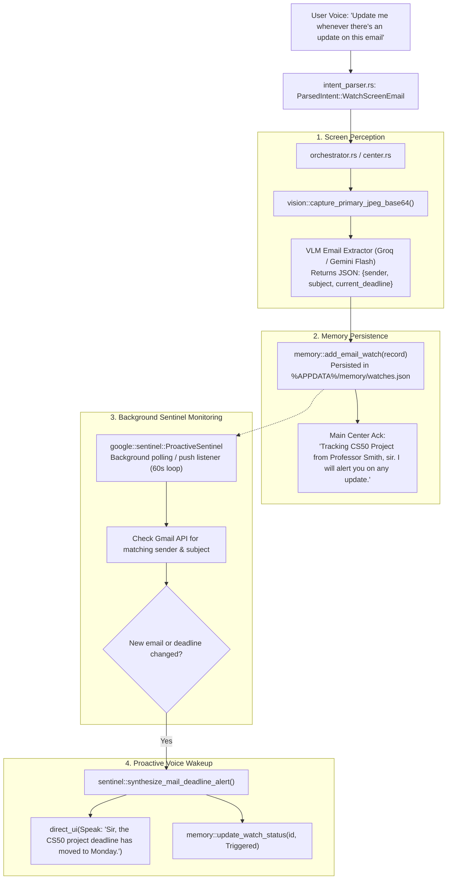

# Feature 76: Vision Mode Screen Email Scanning & Proactive Watch Memory — Implementation Plan

## 0. Executive Vision

When a user looks at an email on their laptop screen and instructs:
> *"NEXUS, update me whenever there is any update on the deadline or anything for this email."*

NEXUS performs an autonomous, zero-friction sequence:
1. **Perceives** the screen via VLM semantic document extraction (Sender, Subject, Extracted Deadline, Thread context).
2. **Remembers** the target in a dedicated active watch memory store (`watches.json`).
3. **Monitors** the target proactively via background Gmail Sentinel.
4. **Alerts** the user via spoken voice and UI the moment a change occurs, without the user ever asking again.

---

## 1. Audit of Current Capabilities: Does Command Center or Memory Have This?

| Component | What Exists Today | What is Missing for this Feature |
|---|---|---|
| **Memory (`memory.rs`)** | `core.json` (key-value strings), `episodes.jsonl` (30-day chat log). | ❌ **No Active Watch Store**: Cannot store watch state, matching criteria, or status (`Active` / `Triggered`). |
| **Vision (`vision.rs`)** | Screenshot capture + coordinate grounding (`{"x": N, "y": M}`) for cursor clicks. | ❌ **No Document Semantic Extraction**: Cannot extract sender, subject, body text, or deadlines from screens. |
| **Command Center (`command_center.rs`)** | Splits compound commands ("A then B"), runs sequential steps. | ❌ **No Persistent Asynchronous Watcher**: Executes immediate steps only; cannot maintain long-running watch daemons. |
| **Google Sentinel (`google/sentinel.rs`)** | `SeenMessageRingBuffer`, alert synthesis for incoming email deadlines. | ⚠️ **Needs Filter Hook**: Processes general incoming messages, but needs connection to `watches.json` to track specific user-flagged emails. |

---

## 2. Architecture & Data Flow



---

## 3. Detailed Component Plan

### 3.1. Vision Document Extraction (`src-tauri/src/vision.rs`)
Implement `extract_screen_email_context()`:
- Captures screen via `capture_primary_jpeg_base64()`.
- Sends image to VLM with system prompt:
  ```text
  You are an expert OCR and document perception engine. Inspect the screenshot and find the email client or open email message.
  Extract:
  1. sender_name and sender_email
  2. subject
  3. current_deadline (if any date, time, due date, or schedule is mentioned)
  4. is_email_visible (boolean)
  Return pure JSON.
  ```
- Parses structured result into `ScreenEmailContext`.

### 3.2. Active Watch Memory Store (`src-tauri/src/memory.rs`)
Add dedicated watch storage:
```rust
#[derive(Debug, Clone, Serialize, Deserialize, PartialEq)]
pub struct EmailWatchRecord {
    pub id: String,
    pub created_at: u64,
    pub sender_name: String,
    pub sender_email: String,
    pub subject: String,
    pub subject_keywords: Vec<String>,
    pub known_deadline: Option<String>,
    pub status: WatchStatus,
}

#[derive(Debug, Clone, Copy, Serialize, Deserialize, PartialEq)]
pub enum WatchStatus {
    Active,
    Triggered,
    Cancelled,
}
```
Functions:
- `add_email_watch(app_data_dir: &Path, record: EmailWatchRecord) -> bool`
- `list_active_watches(app_data_dir: &Path) -> Vec<EmailWatchRecord>`
- `update_watch_status(app_data_dir: &Path, id: &str, status: WatchStatus) -> bool`

### 3.3. Intent Parsing & Soundalike Aliases (`src-tauri/src/intent_parser.rs`)
Add `ParsedIntent::WatchScreenEmail`:
- Triggers:
  - *"update me whenever any update on the deadline for this email"*
  - *"update me when there is an update on this email"*
  - *"watch this email for deadline changes"*
  - *"track this email and notify me if anything changes"*
  - *"keep an eye on this email"*

### 3.4. Proactive Sentinel Watcher Loop (`src-tauri/src/google/sentinel.rs`)
- Extends Sentinel to actively evaluate `list_active_watches()`.
- Queries Gmail API for threads matching `from:{sender_email}` or `subject:{keywords}`.
- If a message with `internalDate > watch.created_at` appears, or if `MailService::parse_deadline_update` finds a new deadline:
  - Synthesizes `ProactiveAlert` with urgency `High`.
  - Marks watch status as `Triggered`.
  - Speaks alert proactively through Main Center.

---

## 4. Verification & Dual-Gate Audit

1. **Vision Extraction Unit Test**: Test with mock VLM JSON response containing sender, subject, and deadline.
2. **Memory Watch Store Unit Test**: Verify persistence in `watches.json`, adding, querying, and updating watch status across app restarts.
3. **Sentinel Watch Matching Unit Test**: Verify that incoming emails matching a watch trigger the alert, while unrelated emails do not.
4. **End-to-End Release Build Verification**: Full test suite pass + release compilation.
