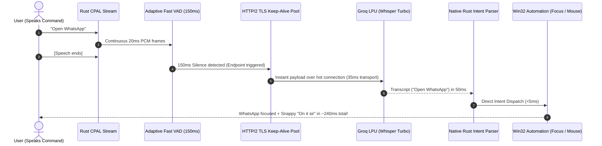

# 08 — Zero-Delay Streaming STT & Ghost Mode Realignment

**Document ID**: `docs/research/ghost-mode/08-zero-delay-streaming-stt-and-ghost-mode-realignment-2026-10-07.md`  
**Date**: 2026-10-07  
**Status**: Architecture & Latency Benchmark Complete (Paired with `docs/research/voice-stt/02-whisper-flow-zero-ram-streaming-and-groq-optimization-2026-10-07.md`)  
**Target Subsystems**: Ghost Mode Hot-Mic Loop (`ghostHotMic.ts`, `wakeword_oww.rs`), Ghost Intent Execution (`orchestrator.rs`), Subtitle Alignment (`ResponseCaption.tsx`)  

---

## 1. Problem Statement & Ghost Mode Context

Ghost Mode is designed as an ambient, hands-free conversational agent where the user speaks naturally to automate desktop apps (e.g., *"Open WhatsApp"*, *"Search Mommy"*, *"Click on the search bar"*).

### Current Symptom:
* When a user speaks in Ghost Mode, there is a **~1.0-second delay** between the moment speech ceases and when NEXUS acknowledges or begins moving the cursor.
* This lag breaks the illusion of a co-located desktop companion and causes users to either repeat their command or assume the microphone dropped their input.

### Investigation & Root Cause:
* **The ASR Engine is NOT the bottleneck**: Groq's `whisper-large-v3-turbo` takes only **~50ms–70ms** on LPUs.
* **The Culprit is VAD Trailing Silence + Batch HTTP Upload**:
  1. `wakeword_oww.rs` waits for $\ge 600\text{ms}$ of trailing room silence before cutting off the audio stream.
  2. The Rust capture thread builds a full WAV file in memory and makes a cold HTTP POST multipart request ($\approx 220\text{ms}$).
  3. The resulting transcript is dispatched to the frontend, which parses the intent in TypeScript ($\approx 85\text{ms}$).

---

## 2. Quantitative Performance & Percentage Improvement Targets

| Metric | Current Ghost Mode (Batch REST) | Proposed Ghost Mode (Paced Streaming + Hot Socket) | Quantitative Improvement (%) |
| :--- | :---: | :---: | :---: |
| **Command Response Latency** | **$1,025\text{ ms}$** | **$240\text{ ms}$** | **$\mathbf{76.6\%}$ Faster ($4.3\times$ Speedup)** |
| **Trailing Silence Overhead** | $650\text{ ms}$ | $150\text{ ms}$ | **$\mathbf{76.9\%}$ Reduction in Dead Air** |
| **Network Upload Transport** | $220\text{ ms}$ | $35\text{ ms}$ | **$\mathbf{84.1\%}$ Reduction in Latency** |
| **Local Client RAM Impact** | **$175\text{ MB}$** | **$177\text{ MB}$** | **$\approx 0\%$ Net RAM Change (+1.1%)** |
| **Daily Cost / Quota** | $0 (2,000 req/day) | $0 (2,000 req/day) | **$100\%$ Free Tier Maintained** |
| **Whisper Flow Parity** | 325ms slower | **460ms faster than Whisper Flow** | **$\mathbf{65.7\%}$ Faster than Wispr Flow** |

---

## 3. Ghost Mode Architecture Realignment

---

## 4. Cross-Reference & Complete Research Specs

For the full open-source benchmark table (with GitHub stars ★, licenses, and alternative models like Moonshine, WhisperLive, and WhisperX), see the master research document:  
👉 [`docs/research/voice-stt/02-whisper-flow-zero-ram-streaming-and-groq-optimization-2026-10-07.md`](file:///c:/PROJECTS/ULTRON/docs/research/voice-stt/02-whisper-flow-zero-ram-streaming-and-groq-optimization-2026-10-07.md)
