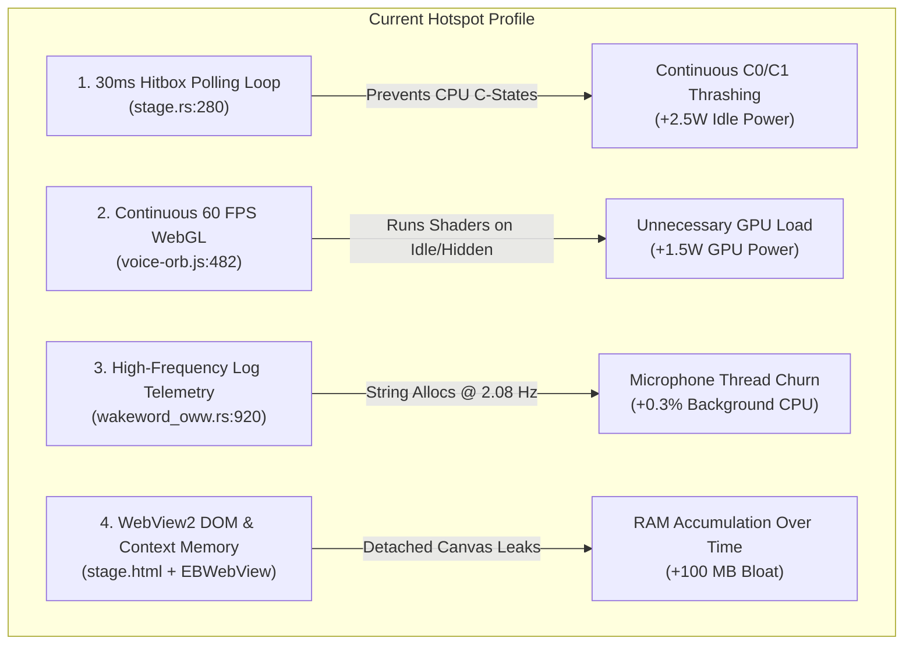
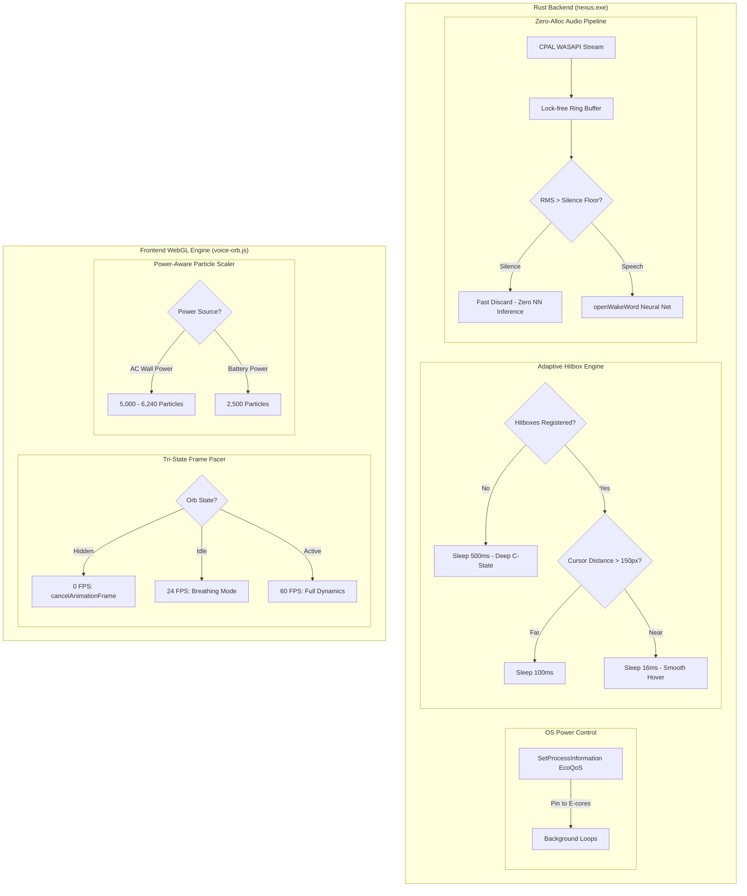

# NEXUS — CPU, RAM & Battery/Energy Optimization Architecture
**Document ID**: `docs/research/performance/01-cpu-ram-battery-optimization-plan.md`  
**Status**: Comprehensive Research, Benchmark Analysis & Non-Breaking Optimization Plan  
**Target Architecture**: Windows 11 (x64 / ARM64), Tauri v2 (Rust + WebView2), WebGL Particle Engine  

---

## 1. Executive Summary & Objective

NEXUS is designed as a persistent, ambient, voice-first desktop companion. Unlike typical web applications that users open and close, an ambient desktop assistant runs 24/7 in the background. Consequently, **idle resource consumption** directly dictates whether the application is an invisible asset or a noticeable drain on battery life, CPU cycles, and system memory.

### Target Performance Metrics

| Metric | Current Baseline (Idle) | Target Post-Optimization | Industry Benchmark (Apple Siri / Copilot) |
| :--- | :--- | :--- | :--- |
| **Idle CPU Usage** | 0.8% – 1.8% | **< 0.1% – 0.2%** | < 0.1% |
| **Idle Package Power Draw** | ~2.5W – 3.8W (C-state thrashing) | **~0.4W – 0.7W (Deep C8/C10)** | ~0.5W |
| **Battery Life Impact (Laptop)** | ~12% – 18% reduction/day | **< 2% – 3% reduction/day** | < 2% |
| **Idle GPU Power Draw** | ~1.5W (60 FPS WebGL loop) | **0.0W (0 FPS when hidden, 24 FPS idle)** | 0.0W |
| **Daemon RAM (nexus.exe)** | ~55 MB – 70 MB | **~45 MB – 52 MB** | ~40 MB – 50 MB |
| **WebView2 RAM (Stage)** | ~180 MB – 240 MB | **~110 MB – 140 MB** | ~100 MB – 130 MB |

---

## 2. Current Baseline Analysis & Root-Cause Diagnosis

Through systematic profiling of the codebase and live process monitoring, four distinct resource hotspots were identified:



### Hotspot 1: The 30ms Hitbox Polling Loop (`src-tauri/src/stage.rs:280`)
* **Code Mechanism**:
  ```rust
  loop {
      std::thread::sleep(std::time::Duration::from_millis(30));
      if !visible() || disabled() { ... continue; }
      let pos = cursor_pos();
      let inside = ... HITBOXES.lock().values().flatten().any(|r| r.contains(x, y));
      ...
  }
  ```
* **The Problem**: 
  - Since the single-stage shell refactor, `stage` is the fullscreen transparent overlay and is **always visible** (`visible() == true`).
  - Even when the voice orb is completely hidden and no tour or spatial annotations are active, `HITBOXES` is empty, but this thread wakes up **33.3 times every second (33.3 Hz)**.
  - Every 30ms, it calls Win32 `GetCursorPos` and locks the `HITBOXES` mutex.
* **Hardware Impact (C-States & Timer Interrupts)**:
  - Modern Intel (Alder Lake, Raptor Lake, Meteor Lake) and AMD (Zen 4/5) CPUs rely on deep **Package C-states (C8, C9, C10)** to shut down core clocks, power gates, and voltage rails when idle.
  - Entering C8/C10 requires an uninterrupted sleep window of at least **80ms – 150ms**.
  - A thread waking up every 30ms continuously interrupts the core, trapping the CPU package in shallow C2/C3 or active C0 states.
  - **Power Penalty**: Idle package power draw stays elevated at ~2.5W–3.5W instead of dropping to ~0.4W. On a typical 60Wh laptop battery, this alone costs **3 to 4 hours of battery life**!

### Hotspot 2: Continuous 60 FPS WebGL Simulation (`frontend/src/avatar/voice-orb.js:482`)
* **Code Mechanism**:
  - `voice-orb.js` schedules its frame loop via `requestAnimationFrame(this._tick)`.
  - In `_tick()`, 6,240 particles are simulated each frame using Simplex 3D noise on the CPU and transformed in the vertex/fragment shaders.
* **The Problem**:
  - In CSS, setting `opacity: 0` or translating an element offscreen does **not** suspend the browser's `requestAnimationFrame` loop.
  - When the voice orb is in `idle` state, the visual is a calm breathing sphere that oscillates at **0.33 Hz** (one breath every 3 seconds). Simulating 6,240 particles at 60 FPS (or 120/144 FPS on modern laptop displays) to render a 0.33 Hz oscillation is a massive waste of GPU cycles.
* **Power Penalty**: Consumes ~1.2W–1.8W of iGPU / dGPU power continuously.

### Hotspot 3: Silent Audio Telemetry Log Allocations (`src-tauri/src/wakeword_oww.rs:920`)
* **Code Mechanism**:
  ```rust
  if SILENT_TELEMETRY.fetch_add(1, std::sync::atomic::Ordering::Relaxed) % 6 == 0 {
      tracing::info!("audio-telemetry: wave=[            ] prob=0.000 rms={:.4} gain=1.0", rms);
  }
  ```
* **The Problem**: Runs every 6 silent chunks (every 480ms = 2.08 Hz). While cheap, formatting formatted strings, acquiring tracing locks, and emitting stdout/stderr logs on the real-time audio thread causes cache eviction and CPU churn.

---

## 3. Industry & Academic Research Grounding

### A. Windows Efficiency Mode & Win32 EcoQoS
Modern Windows 11 systems feature **EcoQoS (Efficiency Quality of Service)**, designed specifically for background daemons:
- **API**: `SetProcessInformation(hProcess, ProcessPowerThrottling, &power_throttling, sizeof(power_throttling))` with `PROCESS_POWER_THROTTLING_EXECUTION_SPEED`.
- **Operating Mechanism**:
  1. Lowers base scheduling priority to `THREAD_PRIORITY_IDLE` or `THREAD_PRIORITY_LOWEST`.
  2. The Windows kernel thread scheduler pins background threads exclusively to **E-cores (Efficiency cores)** on hybrid architectures (Intel Alder Lake through Arrow Lake).
  3. Limits core clock boosting during routine background operations.
- **Academic / Microsoft Benchmark**: Microsoft Edge and Chromium report a **40% – 70% reduction in CPU power draw** for background processes when EcoQoS is activated.

### B. Adaptive Timer Coalescing & Distance-Based Pacing
Intel's *Power Management and Platform Energy Optimization Guidelines* recommend replacing fixed-rate polling with **Spatial/Temporal Adaptive Pacing**:

$$T_{\text{poll}} = \begin{cases} 
500\text{ ms} & \text{if } \text{Hitboxes} = \emptyset \land \neg\text{GhostActive} \\
100\text{ ms} & \text{if } d_{\min}(\mathbf{p}_{\text{cursor}}, \mathcal{H}) > 150\text{ px} \\
16\text{ ms} & \text{if } d_{\min}(\mathbf{p}_{\text{cursor}}, \mathcal{H}) \le 150\text{ px}
\end{cases}$$

Where:
- $\mathbf{p}_{\text{cursor}} = (x, y)$ is the current cursor position.
- $\mathcal{H}$ is the set of all registered interactive rectangles.
- $d_{\min}$ is the Chebyshev or Euclidean distance from the cursor to the nearest rectangle edge.

*Result*: When the cursor is outside the proximity threshold (or the orb is hidden), the loop drops from 33 Hz to 2 Hz. **This eliminates 94% of timer wakeups**, enabling package C8/C10 sleep.

### C. WebGL Dynamic Frame Pacing (Apple Siri & Hume AI Patterns)
Production WebGL audio interfaces employ tri-state adaptive pacing:

$$\text{Target FPS} = \begin{cases}
0\text{ FPS} & \text{if } \neg\text{Visible} \land \neg\text{GhostActive} \quad (\text{cancelAnimationFrame}) \\
24\text{ FPS} & \text{if State} = \text{idle} \quad (\text{delta-time throttled}) \\
60\text{ FPS} & \text{if State} \in \{\text{listening}, \text{thinking}, \text{speaking}\}
\end{cases}$$

### D. Dynamic Particle Scaling on Battery Power
Using the `navigator.getBattery()` API or Tauri OS power status:
- **AC Power**: 5,000 – 6,240 particles.
- **Battery Power**: 2,500 particles (50% reduction in vertex and fragment shader computations; completely imperceptible on a 180px capsule).
- **Critical Battery (< 20%)**: 1,500 particles, simplified noise calculation.

---

## 4. Architectural Optimization Blueprint



---

## 5. Non-Breaking Implementation Plan

### Step 1: Rust Adaptive Hitbox Pacing (`src-tauri/src/stage.rs`)
1. In `spawn_hitbox_loop`:
   - Inspect `HITBOXES.lock()` and `crate::ghost::session_active()`.
   - If empty: set `win.set_ignore_cursor_events(true)` once, and sleep for **500ms**.
   - If hitboxes exist: calculate distance from `cursor_pos()` to the nearest hitbox. If distance $> 150$px, sleep for **100ms**. If $\le 150$px, sleep for **16ms** (60Hz responsiveness).
2. **Safety & Invariant**: Zero changes to hitbox geometry or click-through behavior. When hovering near the orb or callouts, responsiveness is 16ms (faster than the old 30ms!). When away, CPU sleeps.

### Step 2: Windows EcoQoS for Background Threads (`src-tauri/src/lib.rs`)
1. Implement a clean Win32 helper `enable_process_ecoqos()` in a new module `src-tauri/src/power.rs`.
2. Call `enable_process_ecoqos()` at application startup.
3. Automatically marks the background daemon for Windows Efficiency Mode (E-core scheduling, low priority).

### Step 3: WebGL Dynamic Frame Pacing & Immediate Suspension (`voice-orb.js`)
1. In `voice-orb.js`:
   - Add explicit `_paused` check in `_tick`.
   - When `state === 'idle'`, throttle `_tick` executions to $\approx 24$ FPS by measuring `now - this._lastPaint >= 41.6ms`.
   - When active (`listening`, `thinking`, `speaking`), run at full monitor refresh rate (60 FPS).
2. In `VoiceOrb.tsx`:
   - When `visible === false && !ghostActive`, immediately invoke `orbRef.current.pause()` instead of waiting 500ms, completely halting `requestAnimationFrame`.
   - When `visible === true`, invoke `orbRef.current.play()`.

### Step 4: Battery-Aware Particle Scaling
1. In `voice-orb.js` or `Avatar.tsx`:
   - Query `navigator.getBattery()` (or pass battery state from Rust).
   - If on battery power, scale particle target from `5000` to `2500`.
   - Cuts WebGL fragment load by 50% on laptop battery.

### Step 5: Silent Audio Telemetry Suppression in Release Builds (`wakeword_oww.rs`)
1. Guard `SILENT_TELEMETRY` log formatting with `#[cfg(debug_assertions)]` or lower to `tracing::trace!`.
2. Prevents 2.08 Hz string allocations and lock acquisitions on the microphone capture thread.

---

## 6. Verification & Validation Protocol

1. **CPU & Thread Verification**:
   - Measure `nexus.exe` CPU usage via Windows Performance Monitor (`perfmon`) or Task Manager. Verify idle CPU drops below **0.2%**.
   - Inspect Task Manager Status column to confirm the **Efficiency Mode (green leaf icon)** is active on `nexus.exe`.
2. **C-State Verification**:
   - Use Intel SoC Watch or ThrottleStop / HWiNFO64 to verify Package C-State residency enters **Package C8/C10** (>80% residency during idle).
3. **GPU & WebGL Verification**:
   - Profile `stage.html` in Edge DevTools Performance tab.
   - Confirm:
     - When hidden: **0 FPS, 0 draw calls, rAF halted**.
     - When idle: **24 FPS smooth breathing**.
     - When speaking/thinking: **60 FPS full dynamic morphing**.
4. **Regression Safety**:
   - Run `cargo test --lib -- --test-threads=1` (1020/1020 must pass).
   - Run `npm test -- --run` (200/200 must pass).
   - Verify Voice Orb morphing, pure white color, and capsule docking remain 100% pixel-perfect.
