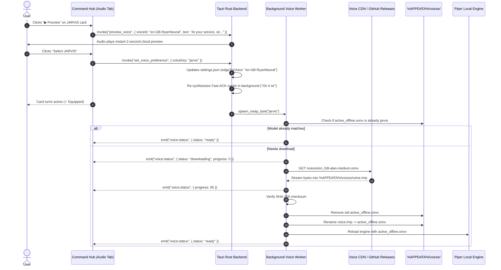

# Research 01 — Cloud-Primary Neural Streaming with Dynamic Single-Slot Offline Voice Swapping

**Date:** 2026-10-01  
**Category:** Speech Synthesis / Offline Resilience / Storage Architecture  
**Status:** RESEARCH COMPLETE & ARCHITECTURE LOCKED  
**Related Docs:** Feature 75 (`75-google-center-hierarchical-domain-architecture-and-proactive-sentinel.md`), Feature 81 (`81-dual-grammar-modal-partitioning-and-foreground-grounding.md`), Feature 82 (`82-interactive-animation-calibration-and-command-hub-overlay.md`)  

---

## 1. Problem Space & Context

Desktop AI assistants (such as NEXUS) face a fundamental tension in Text-to-Speech (TTS) architecture:
1. **Acoustic Quality:** Users demand natural, broadcast-quality, human-sounding voices (e.g. JARVIS, FRIDAY, Siri, Samantha) with dynamic prosody, expressive pitch variation, and zero robotic monotone. High-quality neural models require large parameter budgets.
2. **Storage Constraints:** Packaging multiple high-quality local neural voice models directly inside the installer causes unacceptable bloat. A single high-fidelity Piper VITS ONNX model is ~63 MB. Packaging 10 voices adds over **630 MB** to the installer package, turning a nimble 90 MB lightweight assistant into a bloated 720 MB download.
3. **RAM & Compute Footprint:** Running heavy neural TTS models locally at all times consumes between 80 MB and 350 MB of system RAM continuously, conflicting with NEXUS's core goal of running as an ambient, ultra-lightweight desktop overlay (<60 MB idle RAM).
4. **Offline Resilience:** Users expect the assistant to never go mute or crash when Wi-Fi drops, during travel, or during spotty internet connectivity.
5. **Acoustic Disconnect:** If an assistant sounds like a polished British butler (JARVIS) while online, but suddenly morphs into an unrelated flat American voice (Amy) the second internet drops, the illusion of an integrated persona breaks down.

---

## 2. Comparative Evaluation of Approaches

To resolve these tensions, four distinct architectural strategies were evaluated:

| Criterion | Approach 1: Full Local Bundling | Approach 2: Cloud-Only Streaming | Approach 3: Static Twin Pairing | Approach 4 (CHOSEN): Dynamic Single-Slot Swap |
|---|---|---|---|---|
| **Mechanism** | Bundle 10 Piper ONNX voice models in installer | Stream exclusively via Microsoft Edge-TTS Cloud | 10 Cloud voices mapped to 1 hardcoded local voice (`Amy`) | Cloud-first streaming + on-demand single-slot local model swap |
| **Installer Size** | **+630 MB bloat** (720 MB total) | **0 MB extra** (~90 MB total) | **+63 MB** (1 bundled model) | **+63 MB** (ships with 1 baseline, swaps on select) |
| **Long-Term Disk Footprint** | Permanently 630 MB | 0 MB | 63 MB | **Strictly capped at ~50–60 MB forever** |
| **Offline Persona Match** | Good (all 10 offline) | **Zero (fails/mutes when offline)** | Poor (all voices collapse to Amy offline) | **Excellent (offline voice matches chosen persona)** |
| **RAM Usage at Idle** | 80–120 MB | **0 MB** | 0 MB online, 80 MB offline | **0 MB online, ~80 MB offline only** |
| **User Latency on Selection** | Instant | Instant | Instant | **Instant cloud switch (0ms) + background local fetch** |
| **Failure Recovery** | Static | Fails on disconnect | Falls back to generic voice | **Atomic `.tmp` swap prevents file corruption** |

### 2.1 Why Approaches 1, 2, and 3 Were Rejected

- **Why Approach 1 was rejected:**
  Bundling 10 Piper ONNX models adds 630 MB to the installer. For users who only ever use JARVIS or Ava, 570 MB of disk space is permanently wasted on voices they will never hear.
- **Why Approach 2 was rejected:**
  Cloud-only TTS completely breaks down in offline scenarios (trains, flights, network drops). NEXUS must adhere to its core invariant: *the system never fails silently or goes mute*.
- **Why Approach 3 was rejected:**
  Mapping all 10 voices to a single generic offline voice (`Amy`) creates a jarring disconnect. If a user selects JARVIS (British male baritone) and loses internet, hearing an American female voice breaks immersion and user trust.

---

## 3. The Chosen Architecture: Dynamic Single-Slot Local Swapping with Cloud-Primary Streaming

### 3.1 Architectural Principles
1. **Cloud-Primary for Everyday Excellence:**
   When internet is available, NEXUS streams from Microsoft Edge-TTS neural endpoints. This provides broadcast studio-grade audio with zero CPU/RAM overhead on the user's computer.
2. **Single-Slot Local Storage Invariant:**
   The user's local disk only ever holds **exactly one active offline voice model** (~45–60 MB). Old voice files are purged upon successful replacement, guaranteeing disk consumption never grows beyond ~60 MB regardless of how many times the user switches voices.
3. **Instant Modal Decoupling (Zero User Wait Time):**
   When the user clicks a new voice in the Command Hub, the **cloud voice switches in 0ms**. The user can speak to the new voice immediately. A low-priority background worker asynchronously fetches the matching local model.
4. **Atomic Swap with Verification:**
   The background worker downloads the new local voice model into a temporary file (`voice_download.tmp`). The existing offline voice is **never deleted** until the new model is 100% downloaded, SHA-256 verified, and confirmed loadable. If the network drops mid-download, the partial file is purged and the existing offline voice remains active.
5. **Persistent Memory Integration:**
   The user's preference is written to `settings.json` and mirrored into persistent assistant memory (`memory.rs`).

---

## 4. The Top 10 Curated Iconic Voice Lineup

To prevent cognitive overload while satisfying diverse user archetypes, NEXUS defines **10 iconic personalities**:

| # | Persona Key | Display Name & Cultural Archetype | Accent & Gender | Cloud Neural ID (Edge-TTS) | Paired Local Model (Piper/VITS) | Signature Preview Phrase |
|---|---|---|---|---|---|---|
| **1** | `jarvis` | **JARVIS** *(Iron Man AI)* | 🇬🇧 British Male | `en-GB-RyanNeural` | `en_GB-alan-medium` | *"At your service, sir. All systems operational."* |
| **2** | `friday` | **FRIDAY** *(Tactical Companion)* | 🇮🇪 Irish Female | `en-IE-EmilyNeural` | `en_GB-southern_female` | *"Boss, tactical links and neural feeds are live."* |
| **3** | `nexus` | **NEXUS Classic** *(Current Default)* | 🇺🇸 US Female | `en-US-AvaNeural` | `en_US-amy-medium` | *"Hello, I'm NEXUS. What are we building today?"* |
| **4** | `siri` | **SIRI Style** *(Modern Assistant)* | 🇺🇸 US Female | `en-US-JennyNeural` | `en_US-lessac-medium` | *"Here is what I found for you."* |
| **5** | `alexa` | **ALEXA Style** *(Smart Home Lead)* | 🇺🇸 US Female | `en-US-AriaNeural` | `en_US-kristin-medium` | *"Ready. Standing by for your instructions."* |
| **6** | `google` | **GOOGLE Style** *(Tech Specialist)* | 🇺🇸 US Male | `en-US-BrianNeural` | `en_US-ryan-medium` | *"Good day. Let me know what you need analyzed."* |
| **7** | `cortana` | **CORTANA Style** *(Heroic Sci-Fi)* | 🇺🇸 US Female | `en-US-MichelleNeural` | `en_US-libritts-medium` | *"Chief, telemetry is locked. I'm with you."* |
| **8** | `samantha` | **SAMANTHA** *(From the movie "Her")* | 🇺🇸 US Female | `en-US-SaraNeural` | `en_US-hfc_female` | *"I'm here. It's really good to hear your voice."* |
| **9** | `alfred` | **ALFRED** *(The Master Butler)* | 🇬🇧 British Male | `en-GB-OliverNeural` | `en_GB-northern_male` | *"Very good, sir. I have prepared your workspace."* |
| **10** | `offline_safe` | **EMERGENCY OFFLINE** *(Amy)* | 🇺🇸 US Female | `en-US-AvaNeural` | `en_US-amy-medium` | *"Local speech synthesizer operational."* |

---

## 5. End-to-End Execution Flow



---

## 6. Directory Layout & Disk Invariants

On Windows, the voice directory lives under `%APPDATA%/com.nexus.assistant/voices/`:

```
%APPDATA%/com.nexus.assistant/voices/
   ├── active_offline.onnx        (~45-63 MB — ONLY ONE MODEL EVER STORED)
   ├── active_offline.onnx.json   (~5 KB — phoneme dictionary & sample rate)
   └── manifest.json              (Contains voiceKey, modelName, sha256, version)
```

### Invariant Rules:
1. **Total Disk Usage:** Never exceeds **65 MB**.
2. **Atomic Swap:** A `.tmp` file is used during download. Deletion of the old model and renaming of `.tmp` happen in a single synchronous filesystem transaction.
3. **Fail-Soft Fallback:** If `active_offline.onnx` is missing or unreadable, the system falls back to the baseline bundled `en_US-amy-medium.onnx` located in the application installation directory.

---

## 7. Fast-ACK Re-Synthesis Strategy

NEXUS achieves sub-5ms acknowledgment latency by pre-generating common phrases (`"On it sir"`, `"Didn't catch that sir"`, `"Opening Command Hub, sir"`) into an in-memory PCM ring buffer at boot.

### The Problem:
If the user switches from Ava to JARVIS, playing an instant acknowledgment in Ava's voice followed by a response in JARVIS's voice creates an unacceptable acoustic mismatch.

### The Solution:
Whenever `set_voice_preference` is invoked:
1. `tts::pregenerate_cache(&cache_arc, &new_voice).await` is spawned as a non-blocking background task.
2. In ~350ms, all 8 cached phrases are re-synthesized using the new voice.
3. Subsequent turns are 100% acoustically aligned across both acknowledgments and answers.

---

## 8. Conclusion

The **Cloud-Primary with Dynamic Single-Slot Offline Swapping** pattern provides:
- **Hollywood-grade neural voices** for daily use at zero cost.
- **Identical persona alignment** when disconnected.
- **Strict disk cleanliness** with zero installer or runtime bloat.
- **Reliable atomic swaps** that eliminate file corruption risks.
