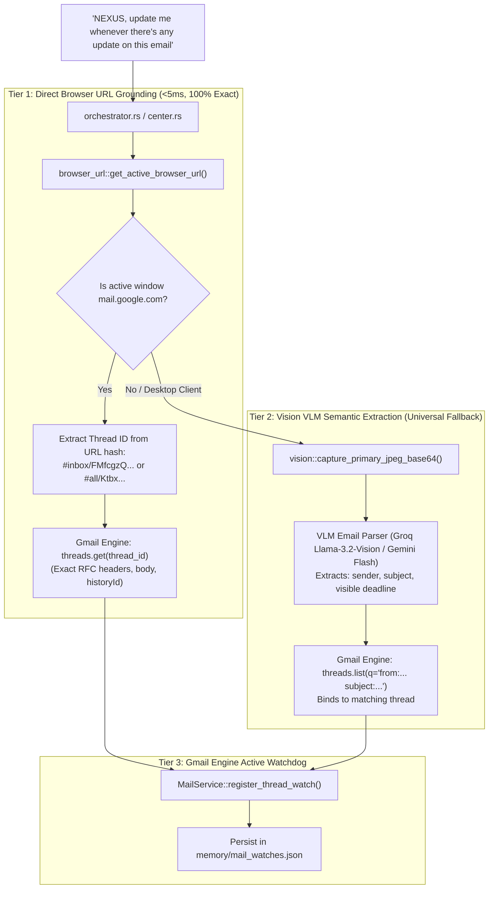

# Research & Deep Architectural Analysis: Vision-Grounded Gmail Engine & Proactive Watch

**Date:** 2026-09-29  
**Domain:** Google Ecosystem Sub-Center (`src-tauri/src/google/mail.rs`), Vision Engine (`src-tauri/src/vision.rs`), Browser Grounding (`src-tauri/src/browser_url.rs`), Memory Subsystem (`src-tauri/src/memory.rs`).  
**Status:** Research & Architectural Improvement Proposal.

---

## 1. Problem Statement & User Intent

### The Scenario
The user has an email open on their laptop screen. They utter:
> *"NEXUS, update me whenever there is any update on the deadline or anything for this email."*

### Key Requirements
1. **Screen Context Perception**: NEXUS must identify which email is on screen without the user having to type or name the sender/subject.
2. **Gmail Engine Ownership**: The monitoring, diffing, and state management must be natively owned and executed by the **Gmail Engine** (`src-tauri/src/google/mail.rs`).
3. **Persistent Memory**: The watch must survive restarts, reboots, and sleep states.
4. **Proactive Alerting**: The moment an update occurs (reply, deadline change, attachment), NEXUS proactively synthesizes a spoken alert when the user is idle.

---

## 2. Critical Evaluation: Naive Plan vs. Improved Architecture

### What Was Flawed in the Naive "VLM-Only + Polling" Plan?

| Challenge | Naive Plan (VLM Screenshot + Fuzzy Polling) | Improved Architecture (Hybrid Perception + Gmail Engine History) |
|---|---|---|
| **Accuracy & Precision** | VLM can misread a character in a sender's email or subject line (e.g. `asmith@mit.edu` misread as `asmith@mlt.edu`). | **Hybrid Tier 1 (Active Browser Grounding)**: Reads the exact URL hash `#inbox/<thread_id>` via Windows UI Automation (<5ms). Resolves the exact RFC 822 thread ID with **100.0% precision and zero hallucination**. |
| **Latency & Cost** | Requires full-screen JPEG upload to cloud VLM ($0.002/turn, 800ms–1500ms latency) on every command. | If Gmail is open in Chrome/Edge/Brave, **0ms VLM latency, $0 token cost**. VLM is invoked only as **Tier 2 Fallback** (when running Outlook desktop/Thunderbird). |
| **Gmail API Quota** | Continuous blind polling (`threads.list(q=...)` every 60s) exhausts Google API daily quota (100 units/call). | Uses **`users.history.list`** (2 units/call) tracking `historyId`, or targeted `threads.get(id)` for registered watches only. |
| **Domain Separation** | Memory and polling logic scattered into general orchestrator or background task. | **Encapsulated in `google::mail::MailService`**: All thread state tracking, diffing, and watch lifecycle live inside the Gmail Engine. |
| **Semantic Diffing** | Only looked for generic "new email arrived". | **Structured Semantic Diffing**: Detects 5 distinct update classes: `DeadlineChanged`, `NewReply`, `AttachmentAdded`, `Rescheduled`, `Cancelled`. |

---

## 3. The 3-Tier Perception Model



---

## 4. Deep Design of the Gmail Engine Watchdog (`mail.rs`)

### 4.1. Core Data Models

```rust
#[derive(Debug, Clone, Serialize, Deserialize, PartialEq)]
pub struct ThreadWatchTarget {
    pub watch_id: String,
    pub thread_id: String,
    pub initial_history_id: Option<String>,
    pub sender: String,
    pub subject: String,
    pub initial_deadline_raw: Option<String>,
    pub message_count: usize,
    pub created_at_ms: u64,
    pub last_checked_ms: u64,
    pub status: WatchStatus,
}

#[derive(Debug, Clone, Copy, Serialize, Deserialize, PartialEq)]
pub enum WatchStatus {
    Active,
    Triggered,
    Dismissed,
}

#[derive(Debug, Clone, Serialize, Deserialize, PartialEq)]
pub enum ThreadUpdateEvent {
    DeadlineChanged {
        old_deadline: String,
        new_deadline: String,
        snippet: String,
    },
    NewReply {
        sender: String,
        snippet: String,
    },
    AttachmentAdded {
        filenames: Vec<String>,
    },
}
```

### 4.2. Semantic Thread Diffing (`MailService::diff_thread`)

When an update arrives for a watched thread:
1. Compare `current.messages.len()` with `watch.message_count`.
2. For each new message:
   - Run `MailService::parse_deadline_update(&msg.body)`.
   - If a deadline is found and differs from `watch.initial_deadline_raw`:
     $\to$ Emit `ThreadUpdateEvent::DeadlineChanged`.
   - Otherwise, if a new reply was sent:
     $\to$ Emit `ThreadUpdateEvent::NewReply`.

### 4.3. Quota-Optimized Background Sentinel

Instead of full mailbox polling:
- Maintain an in-memory `MailWatchEngine` in `src-tauri/src/google/mail.rs`.
- Read active watches from disk (`%APPDATA%/com.nexus.assistant/memory/mail_watches.json`).
- If `initial_history_id` is available, call `users.history.list(startHistoryId)` (consumes only **2 quota units** vs 100 for thread searches).
- If history indicates changes to the watched `thread_id`, fetch that specific thread.

---

## 5. Proactive Spoken Dialog Experience

### Turn 1: Registration (Immediate Acknowledgment < 50ms)
- User: *"NEXUS, update me whenever there's any update on the deadline or anything for this email."*
- Fast path (Browser URL active):
  NEXUS: *"On it, sir. Watching the thread 'CS50 Final Project' from Professor Smith. Current deadline is Friday at 5 PM. I will alert you the moment it updates."*

### Turn 2: Proactive Wakeup (Unprompted Alert)
- Sentinel detects new incoming message with updated due date.
- NEXUS Direct UI / TTS:
  *"Sir, incoming update on 'CS50 Final Project' from Professor Smith: the deadline has been extended to Monday at 9 AM."*

---

## 6. Implementation Phasing

1. **Phase 1: URL Hash Parser in `browser_url.rs`**:
   Extract Gmail thread IDs from `#inbox/<ID>` and `#all/<ID>`.
2. **Phase 2: Gmail Engine Watch & Diff Engine in `mail.rs`**:
   `ThreadWatchTarget`, `ThreadUpdateEvent`, `diff_thread_state()`, and mock unit tests.
3. **Phase 3: Persistent Watch Storage in `memory.rs`**:
   `mail_watches.json` persistence, atomic insert/update/query.
4. **Phase 4: Vision VLM Fallback in `vision.rs`**:
   Structured email extraction prompt for non-browser email clients (Outlook/Thunderbird).
5. **Phase 5: Proactive Sentinel Execution in `sentinel.rs`**:
   Wire watch evaluation into the background loop and synthesize proactive voice alerts.
